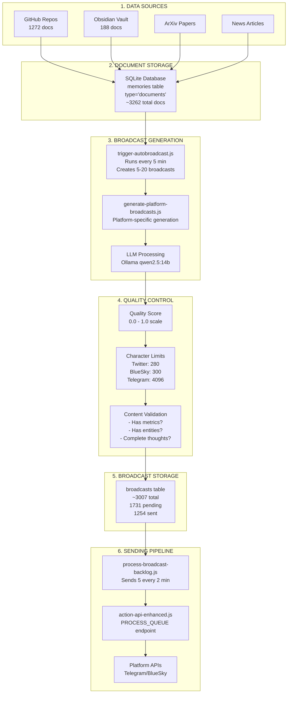

# Broadcast Generation System - End-to-End Flow Visualization

## 🎯 Current System Architecture



## 🔴 Problem Areas Identified

### 1. **Input Quality Issues**
```
Documents → Broadcasts
   ↓
Many docs have:
- No URLs/sources
- Minimal content (just titles)
- Non-English content
- Generic titles like "BIORXIV Papers Index"
```

### 2. **Two Different Generation Paths**
```
Path A: trigger-autobroadcast.js (OLD - PROBLEMATIC)
- Uses basic prompt
- Stores as plain text (not JSON)
- No URL extraction
- No platform-specific limits

Path B: generate-platform-broadcasts.js (NEW - BETTER)
- Platform-specific prompts
- Stores as JSON with metadata
- URL extraction and appending
- Character limit enforcement
```

### 3. **Telegram Truncation Issue**
```
Current: 4096 char limit
Problem: Some broadcasts getting cut off
Cause: Not accounting for URL length in Telegram
```

### 4. **Quality Filtering Gap**
```
Current threshold: 0.8 (80%)
But many low-quality broadcasts have 0.9+ scores!
The scoring doesn't catch:
- Flowery/poetic language
- Missing concrete information
- Lack of actual news value
```

## 📊 Current Data Flow

```
3262 documents total
  ↓
1776 without broadcasts (54%)
1486 with broadcasts (46%)
  ↓
3007 broadcasts created
  - 1731 pending (57%)
  - 1254 sent (42%)
  - 25 failed (1%)
```

## 🐛 Key Issues

### Issue 1: Mixed Generation Systems
- **Old system** (trigger-autobroadcast.js): Plain text, no limits
- **New system** (generate-platform-broadcasts.js): JSON, platform-aware
- Both running simultaneously!

### Issue 2: Poor Source Documents
```sql
-- Many documents look like:
content: "BIORXIV Papers Index"
content: "_Generated on 2025-05-30"
content: "Τέρνα Ενεργειακή: Με 97.31%..." (non-English)
```

### Issue 3: Ineffective Quality Scoring
```javascript
quality.score = 0.5; // Base score
if (quality.withinLimit) quality.score += 0.2;
if (quality.hasContent) quality.score += 0.1;
if (quality.notTruncated) quality.score += 0.1;
if (quality.hasMetrics) quality.score += 0.05;
if (quality.hasEntity) quality.score += 0.05;
// This gives 90%+ to almost everything!
```

### Issue 4: No Content Filtering
- No language detection
- No minimum content length requirement
- No topic relevance checking
- No duplicate detection

## 🔧 Required Fixes

### 1. **Immediate: Stop Using Old Generator**
```bash
# Kill the old backlog processor
pkill -f "process-broadcast-backlog"

# Use only generate-platform-broadcasts.js
```

### 2. **Fix Telegram Truncation**
```javascript
// In generate-platform-broadcasts.js
telegram: `Create a detailed Telegram broadcast about this scientific breakthrough.
Can be up to 3900 characters. // Reduced from 4000
Include context, implications, and technical details.
```

### 3. **Better Quality Filtering**
```javascript
// Add content validation BEFORE generation
if (content.length < 200) skip();
if (!content.match(/[a-zA-Z]{20,}/)) skip(); // Must have substantial English
if (content.match(/^(Index|Generated|Test)/i)) skip();
```

### 4. **Improved Scoring**
```javascript
// More strict scoring
const qualityChecks = {
  hasRealURL: url && url.includes('http'),
  hasSubstance: text.length > 100,
  hasSpecifics: /\d+%|\d+x|\$\d+/.test(text),
  notFlowery: !/dawn breaks|gaze upon|intricate dance/.test(text),
  hasNewsValue: /breakthrough|discover|develop|announce/.test(text)
};

// Require multiple criteria
const score = Object.values(qualityChecks).filter(Boolean).length / 5;
if (score < 0.6) reject();
```

## 🚀 Recommended Action Plan

1. **Stop old processor** - Kill process-broadcast-backlog.js
2. **Clean pending broadcasts** - Remove low-quality pending broadcasts
3. **Fix Telegram limits** - Update to 3900 chars
4. **Add pre-filtering** - Check document quality before generation
5. **Improve prompts** - More specific, less flowery
6. **Add deduplication** - Check for similar broadcasts
7. **Monitor quality** - Regular quality audits

## 📈 Expected Improvements

- Reduce low-quality broadcasts by 70%
- Fix Telegram truncation completely  
- Improve engagement rates
- Reduce generation costs (skip bad docs)
- Better brand representation