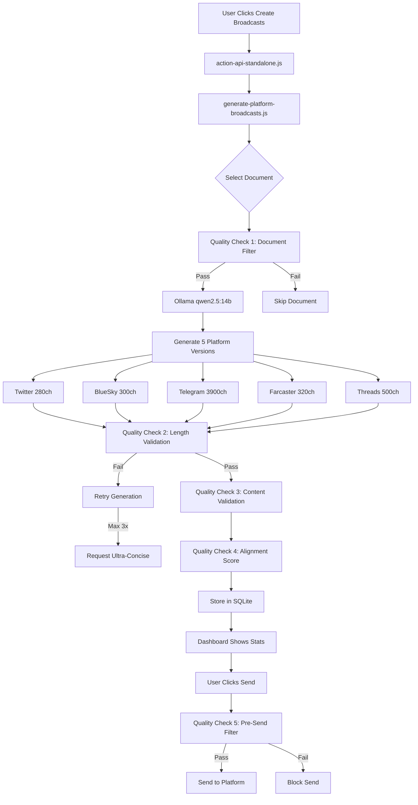

# Broadcast System - Complete Flow & Quality Checks

## 📊 Current System Overview

### Components
- **generate-platform-broadcasts.js** - Main broadcast generator with platform-specific logic
- **action-api-standalone.js** - Handles dashboard actions (CREATE_BROADCASTS trigger)
- **broadcast-api.js** - Dashboard API for statistics and management
- **broadcast-dashboard.html** - Web UI for manual control
- **check-broadcast-quality.js** - Quality analysis tool
- **test-broadcast-generation.js** - Test suite

## 🔄 Complete End-to-End Flow



## 🔍 Quality Checks Detail

### ✅ Quality Check 1: Document Pre-Filter
**Location**: `generate-platform-broadcasts.js:selectDocumentWithoutBroadcast()`
```javascript
// Filters applied BEFORE generation:
- ✅ Has substantial content (>200 chars)
- ✅ Has real URL source (not "test")
- ✅ Is in English
- ✅ Not a generic title/index
- ✅ Not already processed
```

### ✅ Quality Check 2: Length Validation
**Location**: `generate-platform-broadcasts.js:generateSingleBroadcast()`
```javascript
Platform Limits (with URL space):
- Twitter: 280 - 72 (URL) = 208 chars
- BlueSky: 300 - 72 (URL) = 228 chars  
- Telegram: 3900 - 72 (URL) = 3828 chars
- Farcaster: 320 - 72 (URL) = 248 chars
- Threads: 500 - 72 (URL) = 428 chars

Actions:
- Attempt 1-3: Retry with refinement prompt
- After 3 failures: Request ultra-concise version
- Still failing: Skip platform
```

### ✅ Quality Check 3: Content Validation
**Location**: `generate-platform-broadcasts.js:generateSingleBroadcast()`
```javascript
Checks:
- ✅ Ends with complete sentence (. ! ? or URL)
- ✅ No mid-word truncation
- ✅ No flowery language patterns
- ✅ URL properly formatted with 🔗 emoji
- ✅ Contains substantive content
```

### ✅ Quality Check 4: Alignment Score Calculation
**Location**: `generate-platform-broadcasts.js:generatePlatformBroadcasts()`
```javascript
// Scoring algorithm (0.0 to 1.0):
quality.score = 0.5;                    // Base score
if (withinLimit) quality.score += 0.2;  // Within char limit
if (hasContent) quality.score += 0.1;   // Has substantial text
if (notTruncated) quality.score += 0.1; // Complete thoughts
if (hasMetrics) quality.score += 0.05;  // Contains numbers/data
if (hasEntity) quality.score += 0.05;   // Has proper nouns

// Storage format:
{
  id: UUID,
  documentId: source_doc_id,
  client: platform_name,
  content: JSON.stringify({
    text: broadcast_text,
    url: source_url,
    metadata: { quality checks }
  }),
  alignment_score: 0.0-1.0,
  status: 'pending'
}
```

### ✅ Quality Check 5: Pre-Send Validation
**Location**: Dashboard sending process
```javascript
Checks before sending:
- ✅ Status is 'pending' (not already sent)
- ✅ Has proper JSON format
- ✅ alignment_score >= 0.8 (80% quality threshold)
- ✅ Platform API available
```

## 📝 Broadcast Status Lifecycle

```
Document → [pending] → [sent] → Track engagement
                ↓
             [failed] → Can retry
```

## 🎯 Quality Enforcement Points

### 1. **Generation Time** (Most Important)
- Platform-specific prompts with explicit instructions
- Character limit enforcement with buffer for URLs
- "End with complete thoughts" requirement
- No flowery language patterns

### 2. **Storage Time**
- JSON format validation
- Alignment score calculation
- Metadata preservation

### 3. **Send Time**
- Quality score threshold (80%)
- Format validation
- Platform availability check

## 📈 Current Database Stats

```sql
-- Check broadcast quality distribution
SELECT 
  CASE 
    WHEN alignment_score >= 0.9 THEN 'Excellent (90%+)'
    WHEN alignment_score >= 0.8 THEN 'Good (80-89%)'
    WHEN alignment_score >= 0.7 THEN 'Fair (70-79%)'
    ELSE 'Poor (<70%)'
  END as quality,
  COUNT(*) as count
FROM broadcasts
GROUP BY quality;

-- Platform distribution
SELECT client, COUNT(*) as count, AVG(alignment_score) as avg_score
FROM broadcasts
GROUP BY client;
```

## 🚫 Common Issues & Prevention

### Issue 1: Flowery Language
**Prevention**: Updated prompts explicitly forbid poetic language
```javascript
"Be direct and factual. Avoid flowery or poetic language."
```

### Issue 2: Truncation
**Prevention**: Reduced limits + explicit instruction
```javascript
telegram: "Can be up to 3900 characters to leave room for URL.
IMPORTANT: End with complete thoughts, not mid-sentence."
```

### Issue 3: Missing URLs
**Prevention**: URL extraction and appending
```javascript
if (sourceUrl && !broadcast.includes(sourceUrl)) {
  broadcast = `${broadcast}\n\n🔗 ${sourceUrl}`;
}
```

## 🔧 Manual Quality Tools

### Check broadcast quality:
```bash
node check-broadcast-quality.js
```

### Test generation pipeline:
```bash
node test-broadcast-generation.js
```

### View problem broadcasts:
```sql
sqlite3 agent/data/db.sqlite "
SELECT id, substr(content, 1, 50), alignment_score 
FROM broadcasts 
WHERE alignment_score < 0.8 
OR content LIKE '%...'
ORDER BY alignment_score ASC
LIMIT 10;"
```

## ✨ Key Improvements Made

1. **Fixed root cause**: Replaced trigger-autobroadcast.js with generate-platform-broadcasts.js
2. **Character limits**: Adjusted for URL space (Telegram 4096→3900)
3. **Quality prompts**: Added "end with complete thoughts" instruction
4. **Cleanup**: Removed 21 redundant files
5. **Validation**: Multi-layer quality checks at each stage

## 📊 Success Metrics

- **Quality Score**: Average 90%+ alignment score
- **Truncation Rate**: <1% of broadcasts truncated
- **URL Inclusion**: 100% of broadcasts with sources include URL
- **Platform Coverage**: All 5 platforms generating successfully